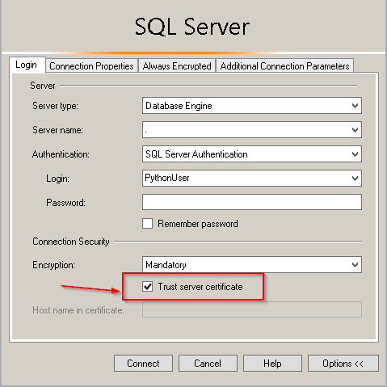

### A simple script to read data from an excel table and insert rows in multiple tables in an SQL Server instance using PYODBC and Pandas

The real scenario involved a list of possible customers that had to be inserted to a mobile sales app backend. The data was more complex and had to update more tables. The app has a local database that synchronizes and gets data from an SQL Server data warehouse in a cloud vm. 

**To use it first install requirements.txt**

```shell
$ pip install -r requirements.txt
```

I used pandas to save the excel table data in a data frame. It is best to do some cleaning steps before you insert the data in the database. Real life data can have random characters especially in address fields (it is a customer list in this case) like commas that can break the SQL insert into statements. I did just some replace steps to replace commas for the example. You can go as far as needed.

**Connecting to the database**

I am using PYODBC to connect to the SQL Server database. The connection string looks like this:

"DRIVER={ODBC Driver 17 for SQL Server};SERVER="+SERVER+";DATABASE="+DATABASE+";UID="+USERNAME+";PWD="+PW+";TrustServerCertificate=yes;"

---

**Note:** you must use a user that has the appropriate privileges to read and write to the DB tables. Check the links bellow:
- https://learn.microsoft.com/en-us/sql/relational-databases/security/authentication-access/create-a-login?view=sql-server-ver16
- https://learn.microsoft.com/en-us/sql/relational-databases/security/authentication-access/create-a-database-user?view=sql-server-ver16
---

- Driver: If you use an on premise SQL sever instance specify the ODBC driver version. If you use a cloud instance you can just use {SQL Server}
- Server: "server_name;port". ex "my_server;1433"
- Data base: The data base name
- UID: The user you use to connect
- PWD: The user password
- TrustServerCertificate parameter: In SQL server on premise you might get a connection error "A connection was successfully established with the server, but then an error occurred during the login process. (provider: SSL Provider, error: 0 - The certificate chain was issued by an authority that is not trusted.) (Framework Microsoft SqlClient Data Provider)". Changing TrustServerCertificate to yes will solve this.



1. First create a connection object

```Python
cnxn = pyodbc.connect(connection_string)
```

2. Then create the cursor object from the connection
```Python
cursor = cnxn.cursor()
```

You can find a quick guide here: https://learn.microsoft.com/en-us/sql/machine-learning/data-exploration/python-dataframe-pandas?view=sql-server-ver16

**Updating the tables**\
At first I tried to loop the data frame rows and execute a single insert into statement for every row. For better performance and to avoid the constant back and forth calls with the database, I used the fast_executemany parameter from PYODBC. 

```Python
cursor.fast_executemany = True
```

Then, instead of using .iterrrows() to get the row data and run the query (bad performance), I used .itertuples() (faster) to create parameter lists for every table by appending all the values I want to insert to the table in a list of tuples, and then just run executemany with the query string and parameters list. 
Updating 6 tables from a list of a little more than 7.000 rows, took less than a minute to run. 

After running the queries, just commit and close the cursor object.

**Note:** I used SQL Server for this use case. PYODBC supports other databases as well. You can find out more in the PYODBC docs:
https://github.com/mkleehammer/pyodbc/wiki


